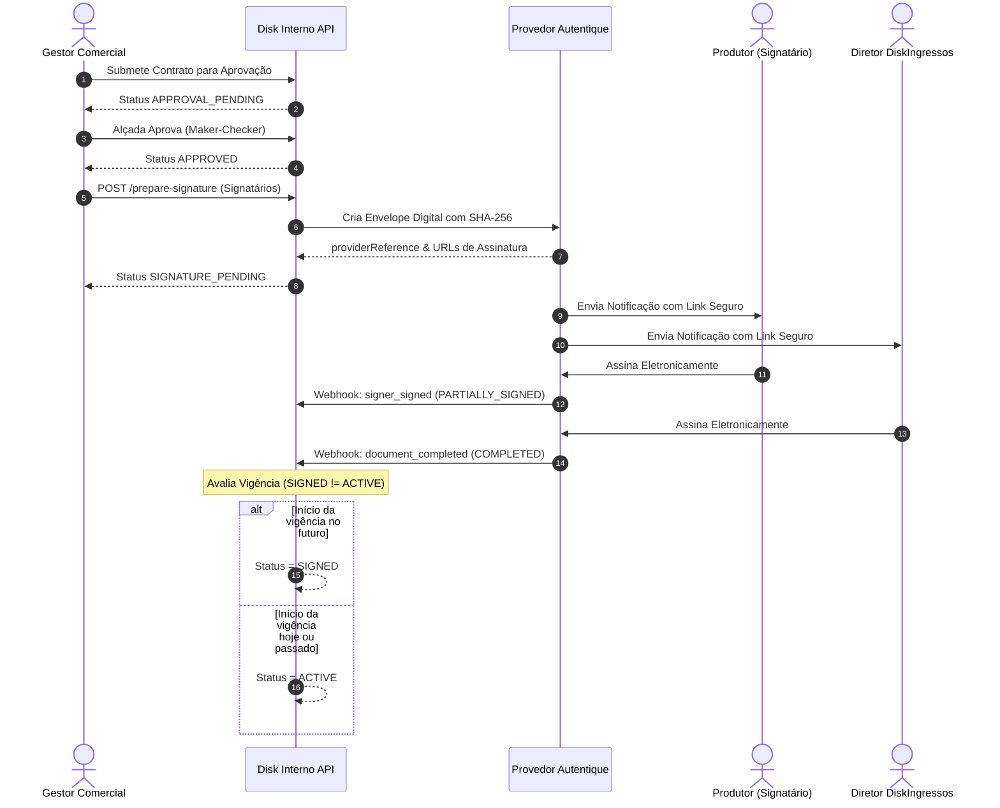

# Integração com Autoridade de Assinatura Digital — Fase 1.3.6

Este documento detalha o padrão de integração para assinatura eletrônica de contratos comerciais B2B na DiskIngressos.

---

## 1. Padrão Provider Adapter (`ISignatureProvider`)

A arquitetura adota o padrão Adapter para desacoplar a aplicação de provedores específicos de assinatura digital:

```typescript
export interface ISignatureProvider {
  createEnvelope(params: CreateEnvelopeParams): Promise<EnvelopeResult>;
  getEnvelopeStatus(providerReference: string): Promise<EnvelopeStatusResult>;
  cancelEnvelope(providerReference: string): Promise<boolean>;
  validateWebhookSignature(payload: any, headers: Record<string, any>, rawBody?: string): boolean;
  parseWebhookPayload(payload: any): WebhookEventResult;
}
```

---

## 2. Provedor Padrão: Autentique (`AutentiqueProvider`)

* **Tipo:** `AUTENTIQUE`
* **Conformidade:** Padrão ICP-Brasil e Medida Provisória nº 2.200-2/2001.
* **Autenticação:** Token de API via cabeçalho `Authorization: Bearer <AUTENTIQUE_TOKEN>`.
* **Webhook Secret:** Assinatura HMAC SHA-256 no cabeçalho `X-Autentique-Signature`.
* **Fallback Interno:** Em ambiente de desenvolvimento ou testes, opera em modo simulado gerando referências rastreáveis e permitindo simulações de assinaturas e eventos de webhook.

---

## 3. Fluxo de Assinatura Ponta a Ponta



---

## 4. Endpoint de Webhook & Idempotência

* **Endpoint:** `POST /api/v1/commercial/contracts/webhook/signature`
* **Autenticação:** Aberto para a autoridade certificadora; validação por HMAC/Header secret.
* **Idempotência:** O manipulador verifica se o envelope correspondente já se encontra em status `COMPLETED`. Se positivo, encerra com HTTP 200 e mensagem de idempotência garantida sem gerar mutações duplicadas.
