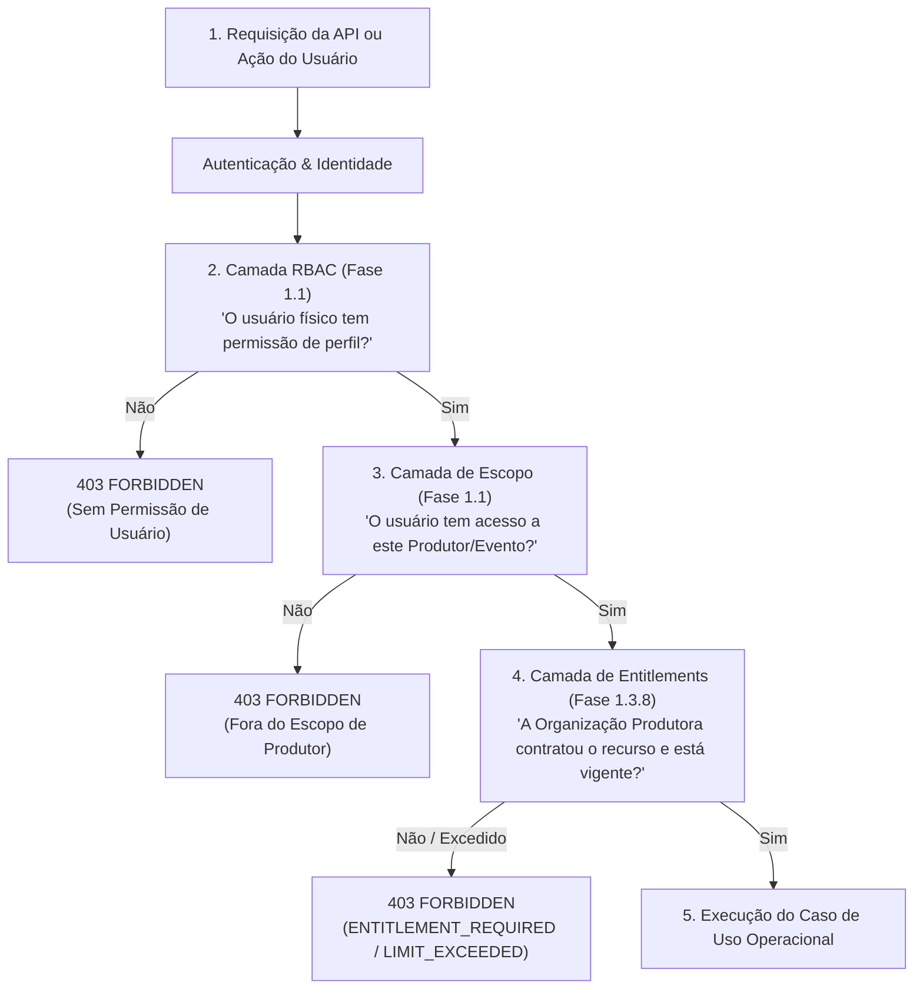

# Matriz de Domínios e Separação de Responsabilidades — Fase 1.3.8

## 1. Visão Sistêmica de Autorização e Direitos

No ecossistema de alta disponibilidade e segurança da **DiskIngressos**, o acesso a qualquer funcionalidade ou recurso operacional depende da composição harmônica de três camadas ortogonais e independentes:

---

## 2. Matriz Comparativa de Domínios

| Dimensão | RBAC (Controle de Acesso) | Entitlements (Habilitações da Organização) | Escopo Multi-Tenant | Contratos Comerciais | Catálogo Comercial |
|---|---|---|---|---|---|
| **Alvo da Governança** | Usuário individual / Operador | Organização Produtora (`Producer`) | Relação Usuário-Produtor | Instrumento Jurídico | Biblioteca Oficial de Ofertas |
| **Entidade Central** | `User`, `Role`, `Permission` | `ProducerEntitlement`, `ProducerEntitlementLimit` | `UserProducerAccess`, `Scope` | `CommercialContract`, `ContractCommercialTerm` | `CommercialOffering`, `CommercialFeature` |
| **Pergunta Fundamental** | *"Quem você é e o que o seu cargo pode fazer?"* | *"O que a sua empresa comprou e possui habilitado?"* | *"Em quais produtores você tem autorização de agir?"* | *"Quais foram os termos jurídicos e datas acordadas?"* | *"O que a DiskIngressos vende e quanto custa?"* |
| **Ciclo de Vida** | Vinculado à admissão, demissão e papel do colaborador. | Vinculado à vigência contratual e aditivos. | Vinculado a convites e equipes do produtor. | Minuta $\rightarrow$ Aprovação $\rightarrow$ Assinatura $\rightarrow$ Vigência. | DRAFT $\rightarrow$ ACTIVE $\rightarrow$ DISCONTINUED (v1, v2). |
| **Origem dos Dados** | Configurações de segurança / RH. | Provisionamento de contratos ou migrações legadas. | Membresia e permissões de escopo. | Negociação comercial e fechamento de propostas. | Engenharia e Estratégia de Produto. |
| **Exemplo Típico** | `eventos.criar` concedido ao Analista Comercial. | Cota de até 5 eventos simultâneos ativos. | Acesso liberado apenas para a produtora "Live Arena". | Contrato CTR-2026-000102 assinado via Autentique. | Oferta "Plano Standard" com taxa de 8% e 3 coletores offline. |

---

## 3. Resolução de Conflitos e Precedência de Decisão

1. **Override Administrativo:**
   - Possui precedência máxima sobre o contrato base.
   - Um override com `action: REVOKE` bloqueia o acesso mesmo que o contrato esteja ativo.
   - Um override com `action: GRANT` libera o acesso mesmo que o produtor ainda não tenha aditado seu contrato.
2. **Maker-Checker:**
   - O gestor que solicita o override não pode ser o mesmo que o aprova se o produtor pertencer à sua carteira direta sem alçada executiva.
3. **Modos de Enforcement:**
   - Permitem testes A/B e migrações suaves (`OBSERVE` e `WARN`) sem gerar interrupções de portaria durante eventos críticos de grande porte.
