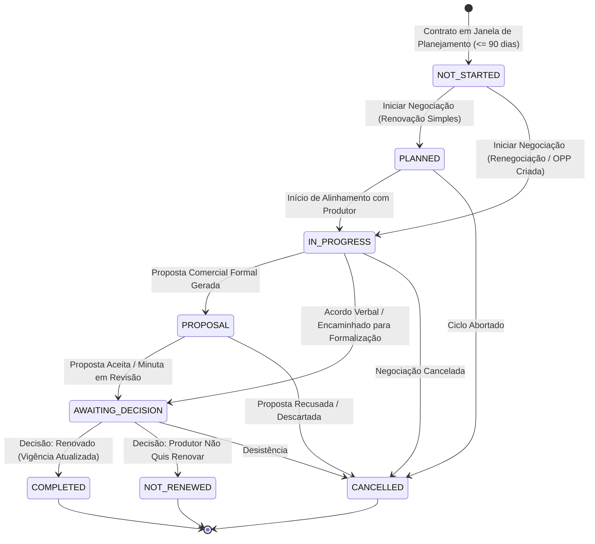

# Matriz de Domínios e Fronteiras Arquiteturais — Fase 1.3.9

**Contexto:** Plataforma Disk Interno PDT / DiskIngressos  
**Módulo:** Comercial — Gestão de Contas, Renovações e Movimentações  
**Status:** VIGENTE E HOMOLOGADO  

---

## 1. Mapa de Responsabilidades por Domínio

Para preservar a integridade corporativa, cada domínio possui fronteiras inegociáveis. A tabela abaixo detalha o papel de cada módulo e as proibições explícitas estabelecidas:

| Domínio / Módulo | O que FAZ na Fase 1.3.9 | O que NÃO PODE FAZER (Proibição Estrita) |
| :--- | :--- | :--- |
| **Gestão de Contas (1.3.9)** | Orquestra o relacionamento pós-venda B2B; monitora janelas de expiração; consolida a carteira; calcula métricas operacionais factuais. | **PROIBIDO:** Criar tabelas paralelas de produtor; inventar health score ou propensão de churn; julgar vendedores com rankings subjetivos. |
| **Central de Renovações (1.3.9 / 1.3.6)** | Controla os ciclos de renovação (`contractId + renewalCycle`); gerencia o fluxo operacional (`NOT_STARTED` -> `COMPLETED`); vincula oportunidade no funil. | **PROIBIDO:** Alterar termos financeiros ou preços sem proposta e aditivo formal; permitir ciclos concorrentes sem versionamento. |
| **Movimentações Comerciais (1.3.9 / 1.3.4)** | Registra oportunidades categorizadas de expansão, upgrade, downgrade e serviços adicionais sobre `CommercialOpportunity`. | **PROIBIDO:** Criar pipeline separado (`AccountMovementPipeline`); alterar plano do produtor diretamente na oportunidade ganha. |
| **Simulador de Impacto (1.3.9)** | Executa análise comparativa consultiva (features adicionadas, removidas, limites, preços) entre o contrato vigente e a oferta pretendida. | **PROIBIDO:** Modificar `ProducerEntitlement`; disparar cobranças; assumir que a simulação tem efeito executório imediato. |
| **Contratos Comerciais (1.3.6)** | Emite minutas e termos aditivos; gerencia envelopes de assinatura digital (Autentique); estende prazos após renovação concluída. | **PROIBIDO:** Permitir vigência retroativa sem registro formal; alterar termos acordados sem aditivo aprovado e assinado. |
| **Catálogo Comercial (1.3.7)** | Fornece snapshots imutáveis de ofertas, versões e composições técnicas como fonte de verdade para novas propostas. | **PROIBIDO:** Mudar preços de contratos já firmados (o contrato é regido pela minuta assinada, não pela tabela de hoje). |
| **Habilitações & Entitlements (1.3.8)** | Ativa, suspende e reconcilia cotas técnicas no atingimento da data efetiva (`effectiveFrom`) do instrumento assinado. | **PROIBIDO:** Liberar features a partir de intenção comercial ou proposta em negociação. |
| **Financeiro & Faturamento** | Processa borderôs, repasses e faturamento com base no `ContractEffectiveTermsService`. | **PROIBIDO:** O Comercial emitir boletos ou faturas diretamente. |

---

## 2. Ciclo de Vida e Máquina de Estados da Renovação



---

## 3. Matriz de Concorrência e Idempotência

| Operação | Chave de Idempotência | Controle de Concorrência | Ação em Caso de Conflito |
| :--- | :--- | :--- | :--- |
| **Início de Negociação** | `contractId + renewalCycle` | Busca ciclo ativo (`PLANNED`, `IN_PROGRESS`, etc.) | Retorna a renovação ativa existente sem duplicar registros |
| **Atualização de Status** | `renewalId + version` | Optimistic Locking (`version: version + 1`) | Lança HTTP 409 (`Conflito de versão`) se a versão em disco diferir |
| **Decisão de Renovação** | `renewalId + version` | Optimistic Locking (`version: version + 1`) | Lança HTTP 409 (`Conflito de versão`) se outro usuário já decidiu |
| **Extensão Contratual** | `contractId + targetEffectiveUntil` | Verificação de data futura e status `ACTIVE`/`SIGNED` | Rejeita se `targetEffectiveUntil` for anterior ao término atual |

---

## 4. Comparador de Impacto Comercial: Vigente vs. Pretendido

O `CommercialChangeImpactService` opera estritamente através da seguinte resolução de fontes:

```text
ESTADO ATUAL DO PRODUTOR                           ESTADO PRETENDIDO
------------------------                           -----------------
Fonte de Preços & Borderô:                         Fonte de Preços Pretendida:
ContractEffectiveTermsService                      Snapshot da Oferta no Catálogo
(Contrato Base + Aditivos Assinados)               (CommercialCatalogProvider)
           │                                                    │
           ├────────────────────────┬───────────────────────────┤
           │                        │                           │
           ▼                        ▼                           ▼
Features & Cotas Contratadas:       │              Features & Cotas Pretendidas:
EntitlementService                  │              Snapshot de Features da Oferta
(listProducerEntitlements)          │              (OfferingFeatureSnapshot)
                                    │
                                    ▼
                      CommercialChangeImpactService
                                    │
            ┌───────────────────────┼───────────────────────┐
            ▼                       ▼                       ▼
     Features Added          Features Removed         Limit Changes
    (Novas Liberadas)     (Avisos de Downgrade)     (Deltas de Cotas)
            │                       │                       │
            └───────────────────────┼───────────────────────┘
                                    │
                                    ▼
                          RISCOS OPERACIONAIS
                   entitlementWillChangeImmediately = FALSE
```

**Garantia Arquitetural:** O resultado do simulador é exibido ao executivo comercial e ao gestor para instruir a proposta e alertar sobre perda de recursos (downgrades), sem qualquer comunicação de escrita com o motor de entitlements.
