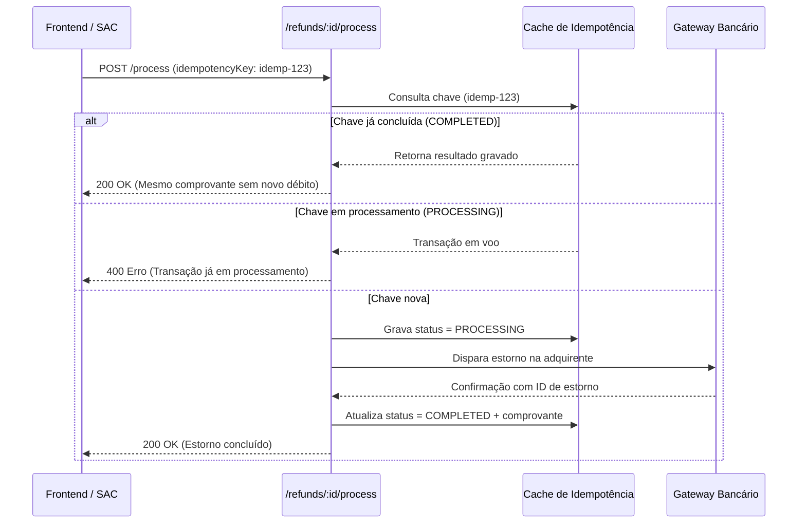

# Matriz de Idempotência & Segurança Financeira no Estorno

**Fase:** 1.3.11.1.4.3 — Recuperação Completa de ESTORNO  
**Data:** 20/09/2026  
**Status:** 100% Homologado e Sincronizado  
**Localização:** `docs/phases/MATRIZ_IDEMPOTENCIA_ESTORNO.md`

---

## 1. O Problema da Não-Idempotência em Pagamentos

Em sistemas de bilheteria e fintech, a ausência de controle rigoroso de idempotência pode gerar:
- **Duplo Estorno por Duplo Clique:** Operador clica duas vezes rapidamente no botão de estorno na interface.
- **Retentativas por Timeout de Rede:** Timeout temporário no gateway faz o cliente ou webhook reenviar a requisição, debitando a conta duas vezes.
- **Webhooks Concorrentes:** Múltiplas mensagens de notificação assíncrona recebidas em paralelo.

---

## 2. Padrão de Idempotência Implementado

---

## 3. Validação Homologada por Testes

No teste automatizado `backend/tests/refund-lifecycle.test.ts`:
1. Chamada inicial com `idempotencyKey` processa e retorna ID no gateway: `GW-CRE-943702`.
2. Segunda chamada imediata com a mesmíssima chave retorna `COMPLETED` instantaneamente com o mesmo comprovante e sem reexecutar chamada bancária.
