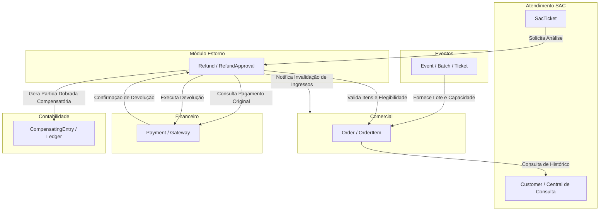

# Matriz Owner × Consumer Definitiva — Fase 1.3.11.1.5

## 1. Princípio de Isolamento

Nenhuma tabela no banco de dados relacional deve possuir múltiplos donos de escrita. Leituras podem ser diretas via repositórios ou via contratos de serviço, mas toda mutação deve ser delegada ao módulo **Owner**.

---

## 2. Relação Proprietário × Consumidores

| Entidade / Recurso | Módulo Proprietário (Owner) | Mecanismo de Mutação | Módulos Consumidores | Mecanismo de Consumo | Invariante Garantida |
|---|---|---|---|---|---|
| **Event** | Eventos | `EventService.create`, `update`, `publish` | Comercial, SAC, Marketing, Financeiro | `EventService.getById`, API `/events/:id` | Evento só pode ser vendido se status for `PUBLISHED` ou `SALES_OPEN`. |
| **Batch / TicketType** | Eventos | `BatchService.createBatch`, `closeBatch` | Comercial | `EventService.getBatchesByEvent` | Ingressos nunca excedem a capacidade máxima do lote cadastrado. |
| **Order / OrderItem** | Comercial | `OrderService.createOrder`, `updateStatus` | SAC, Estorno, Financeiro, Contabilidade | `OrderService.getOrderDetails`, API `/commercial/orders/:id` | Pedido cancelado invalida automaticamente todos os ingressos emitidos. |
| **Customer** | Atendimento SAC | `CustomerService.upsertCustomer`, `updateProfile` | Comercial, Central de Consulta, Marketing | `CustomerService.findCustomerByDocumentOrEmail` | PII de clientes são mascarados em logs e controlados sob LGPD. |
| **SacTicket** | Atendimento SAC | `SacService.openTicket`, `addInteraction` | Central de Consulta, Auditoria | `SacService.listTicketsByCustomer` | Chamados abertos possuem SLA auditável e vínculo ao cliente ou pedido. |
| **Refund** | Estorno | `RefundService.createRefundRequest`, `approve`, `execute` | SAC, Comercial, Financeiro, Contabilidade | `RefundService.getRefundByOrderId`, API `/refunds/:id` | Estornos aprovados disparam invalidação no Comercial e partida compensatória na Contabilidade. |
| **Payment** | Financeiro | `PaymentService.processPayment`, `registerWebhook` | Comercial, Estorno, Contabilidade | `PaymentService.getPaymentByOrderId` | O valor estornado jamais pode superar o valor original liquidado da transação. |
| **CompensatingEntry** | Contabilidade | `AccountingService.recordCompensatingEntry` | Auditoria, DRE, Fechamento Fiscal | `AccountingService.getEntriesByEntity` | Lançamentos contábeis são imutáveis e auditáveis por partida dobrada. |
| **AbandonedCart** | Remarketing | `RemarketingService.trackCart`, `markRecovered` | Comercial | API `/remarketing/recovery-link/:cartId` | Carrinho recuperado converte em Pedido oficial no Comercial sem duplicidade. |

---

## 3. Diagrama de Comunicação entre Módulos

