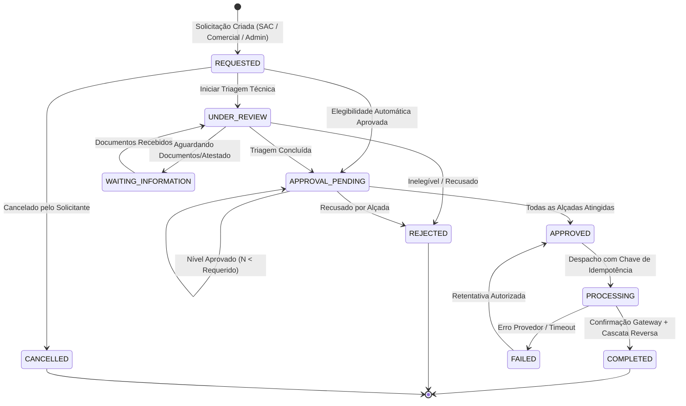

# Matriz de Estados e Transições do Motor de Estornos (State Machine)

**Fase:** 1.3.11.1.4.3 — Recuperação Completa de ESTORNO  
**Data:** 20/09/2026  
**Status:** Especificação e Implementação 100% Homologadas  
**Localização:** `docs/phases/MATRIZ_STATE_MACHINE_ESTORNO.md`

---

## 1. Diagrama de Transição de Estados

---

## 2. Matriz de Transições Permitidas

| Estado Origem | Ação | Estado Destino | Regra de Negócio / Validações |
| :--- | :--- | :--- | :--- |
| `REQUESTED` | `startReview()` | `UNDER_REVIEW` | Operador assume a análise da solicitação |
| `REQUESTED` | `cancel()` | `CANCELLED` | Solicitante retira a solicitação antes da triagem |
| `UNDER_REVIEW` | `requestInfo()` | `WAITING_INFORMATION` | Pendência de atestado médico ou dados complementares |
| `WAITING_INFORMATION`| `resumeReview()` | `UNDER_REVIEW` | Cliente enviou os documentos solicitados |
| `UNDER_REVIEW` | `sendToApproval()` | `APPROVAL_PENDING` | Saldo remanescente e regras checadas; requer alçada |
| `UNDER_REVIEW` | `reject()` | `REJECTED` | Recusa formal com justificativa mínima de 5 caracteres |
| `APPROVAL_PENDING` | `approve()` | `APPROVAL_PENDING` / `APPROVED` | **Maker-Checker:** solicitante ≠ aprovador. Se `aprovados >= requeridos`, vai para `APPROVED` |
| `APPROVAL_PENDING` | `reject()` | `REJECTED` | Recusado por alçada superior |
| `APPROVED` | `process()` | `PROCESSING` | Envio ao gateway adquirente com registro de `idempotencyKey` |
| `PROCESSING` | `confirm()` | `COMPLETED` | Provedor confirmou devolução; aciona invalidação de QR Code e lançamentos no Ledger |
| `PROCESSING` | `fail()` | `FAILED` | Recusa do adquirente ou timeout sem confirmação |
| `FAILED` | `retry()` | `APPROVED` | Reprocessamento com nova chave de idempotência de retentativa |
